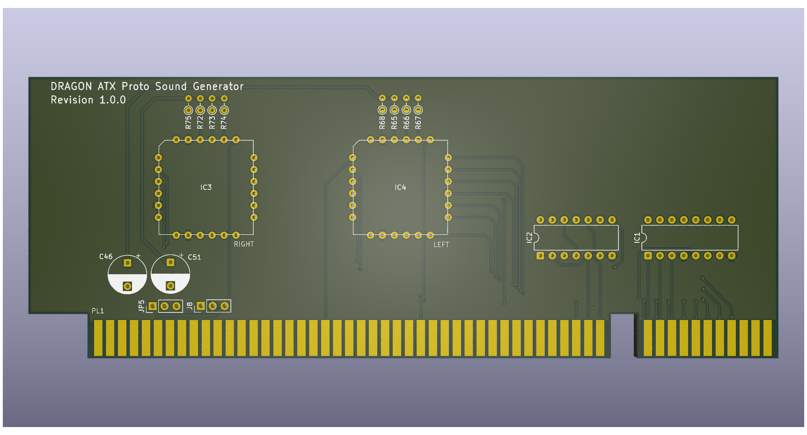

# Dragon 32 ATX Prototype Audio

This repository contains the KiCad project files
to produce the Audio component board for my
ATX Prototype backplane.

This design requires the ATX backplane board in order 
to operate
See https://github.com/jimbro1000/DragonATXProto

## Notes

Revision 1 includes provision for two emulated AY 
sound generators. Each is dedicated to one stereo
channel, both are mixed to create a single central
channel for output over the regular composite
monitor output.

The board can be implemented with just the left
sound generator.

This design has been completed using KiCad 9. Earlier
versions of KiCad are not compatible.
